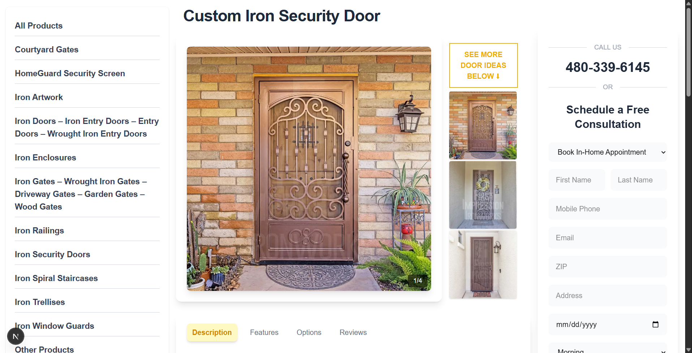
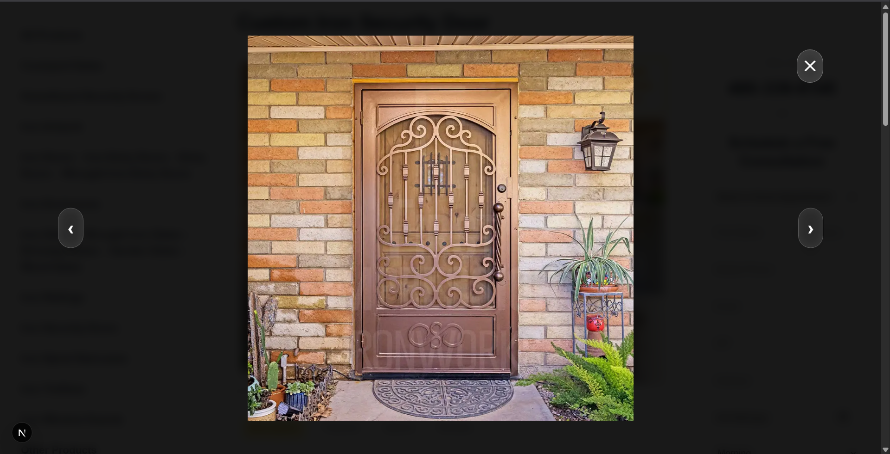
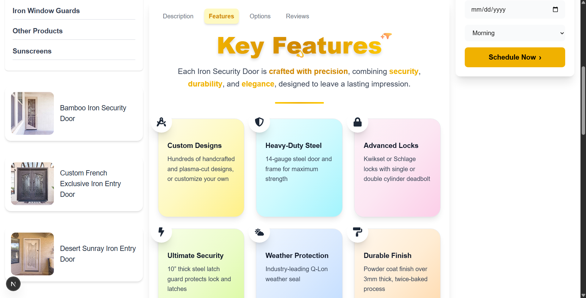
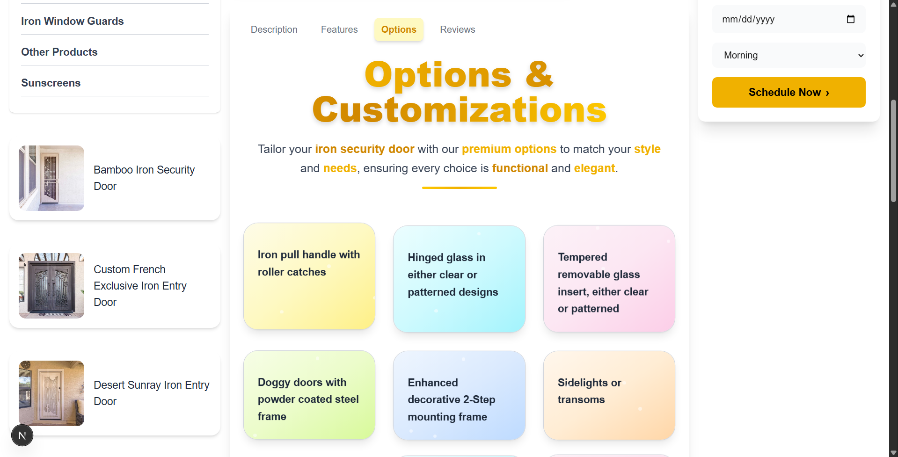
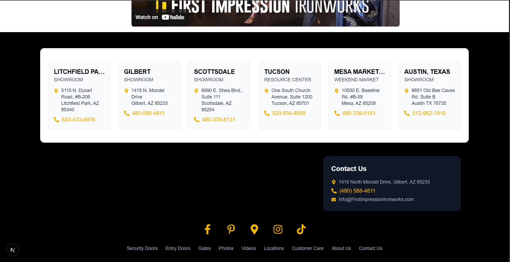

# Door Showcase App 🚪✨

This project is a Next.js application designed to showcase various door designs and related products. It provides a visually appealing and interactive experience for users to explore different door styles, view customer reviews, and request consultations. The application features a modern design with a focus on user experience, utilizing components like image swipers, tabbed interfaces, and embedded YouTube videos to present information effectively.

## 🚀 Key Features

- **Image Swiper:** Displays a slideshow of door images to showcase different styles.
- **Tabbed Interface:** Organizes detailed information about products into easily navigable tabs (Description, Features, Reviews, etc.).
- **Customer Reviews:** Displays customer reviews in a visually appealing card format.
- **YouTube Embed:** Integrates a YouTube video to provide additional information or demonstrations.
- **Sidebar Navigation:** Provides easy access to different product categories.
- **Call Form:** Allows users to schedule a free consultation.
- **Responsive Design:** Ensures the application looks and functions well on different screen sizes.
- **Optimized Images:** Uses `next/image` for optimized image loading and performance.

## 🛠️ Tech Stack

- **Frontend:**
  - React
  - Next.js
  - Tailwind CSS (for styling)
  - `next/image` (for image optimization)
  - `next/font/google` (for Google Fonts)
  - `react-icons/fa` and `react-icons/fa6` (for icons)
- **Other:**
  - JavaScript/JSX
  - HTML
  - CSS

## 📦 Getting Started

Follow these steps to get the project up and running on your local machine.

### Prerequisites

- Node.js (version 18 or higher)
- npm or yarn

### Installation

1. Clone the repository:

    ```bash
    git clone <repository_url>
    cd <project_directory>
    ```

2. Install dependencies:

    ```bash
    npm install  # or yarn install
    ```

### Running Locally

1. Start the development server:

    ```bash
    npm run dev  # or yarn dev
    ```

2. Open your browser and navigate to `http://localhost:3000`.

## 📂 Project Structure

```planetext
door-showcase-app/
├── app/
│   ├── components/
│   │   ├── CallForm.jsx
│   │   ├── Footer.jsx
│   │   ├── ImageSwiper.jsx
│   │   ├── MoreDoorIdeas.jsx
│   │   ├── OtherProduct.jsx
│   │   ├── ReviewCard.jsx
│   │   ├── Sidebar.jsx
│   │   ├── Tab.jsx
│   │   └── YouTubeEmbed.jsx
│   ├── layout.tsx
│   └── page.tsx
├── next.config.js
├── package.json
├── postcss.config.js
├── README.md
├── tailwind.config.js
└── tsconfig.json
```

## 📸 Screenshots







## 📝 License

This project is licensed under the [MIT License](LICENSE).
